# Barkley Group Project - Project 4

The link to live project can be found here - https://barkley-group-4246915066fd.herokuapp.com/

The link to github repository can be found here - https://github.com/declanwatts97/barkley_group_project

### Introduction

Welcome to Barkley Group! We are an accountancy practice located in the Team Valley, Gateshead. Explore our site for information about our services provided, create an account to become a client, or request a consultion with one of our advisors.

## Table of Contents

## User Experience

### User Requirements

The website has been created with the below goals in mind:

1. Accessability - The website needs to be full accessible so that all users can view it as it was intended. 

2. Meeting Request System - The website needs to allow users to request meetings, to give new clients an easy option to get in touch and current clients access to online meeting bookings.

3. My Account Page - The website needs to allow users to create an account and view their account through the webpage. This will allow them to add services they require and inform us online what is required of us.

4. Checkout - The website needs to allow users to pay for the required services through this page, facilitating the ability to pay up front and with ease online.

5. User Authentication - To facilitate the above points, users must be able to sing up and log in to accounts where the My Account page and checkout can be shown..

6. Admin Access to Database - The website must have admin access to the database, so the admin can view meeting requests and services assigned against user accounts.

## User Stories
### Website Visitors

1. As a user I require clear and easy navigation. This will allow me to find information and let me make an informed decision on whether to become a new client.

2. As a user I require the website to be responsive, so that I can access it on any device I may have. I need to be able to access my account from mobile or desktop.

3. As a user I require the ability to request a meeting, for ease of use and so I dont have to call the office each time I need to book a meeting.

4. As a user I require a My Account page, where I can add my services I need work done on. This can constantly change so needs a way to show the admin what work I need.

5. As a user I require a checkout page, so I can pay for my required services upfront and online. This is so I dont need to come into the office to make card payments.

### Acceptance Criteria

1.  The user should be able to clearly navigate around the website through all nav links, in both the Navbar and footer links. The links should take the user to the exact part of the page they need to view.

2.  The user should be able to access the site from a tablet, phone or desktop with no loss of access or features. The layout should be adaptive and the buttons should work from header, footer and in the page content.

3.  When the user is on the meeting request page, they should be prompted to fill in Full Name, Date and Time, Service, New Client? and a comment for the reason for the meeting. A request received message should show up when submitted. The booking should be stored in the database. All required fields should be validated before submission.

4. When the user is authenticated, they should be able to access a My Account page through the navbar, which allows them to add, remove, update and delete services from their account. There should also be a pay now button linking to the checkout.

5. When the user clicks the pay now button on the my account page, they should be redirected to a stripe checkout where they can make a payment for the relevant service.

### Goals of Site Developers

1. As a developer I require clean code which follows the standard for readability. This ensures any changes can be easily made and the code understood by other contributors.

2. As a developer I require a database model relevant to the project and entity relationship diagram to outline the reason for the model.

3. As a developer I require the site to be responsive on all devices and browsers, allowing the customer base the best possible experience when viewing the site.

4. As a developer I require a detailed Readme document which outlines the planning, development and deployment procedure.

5. As a developer I require customers to be able to request meetings, and if authenticated through sign in be able to view, edit and delete services they have added to their accounts.

### Acceptance Criteria

1. In the finished project, all HTML should follow semantic structure, all indentation is consistent, and the pages should pass through validation without error.

2. In the project repository, there should be a models.py file with the designed model for the database and also an entity relationship diagram shown in the readme.

3. When the site is deployed and tested on Mobile, Tablet and Desktop then no layout breaks should occur, and all content should resize nicely to fit chosen device. 

4. If a new contributor clones the repository and opens the readme, they should have a full description of the purpose of the project, design choices made and the deployment procedure.

5. When signed in, the user should be able to view all active services they have and be able to edit and delete services direct from the my account page.

## Structure

The site has 9 active pages:

- A home landing page
- An our services page, explaining what it is we do
- A request meeting page, where current or new clients can request to come in for a consult with one of our accountants.
- A log in page, so that users can authenticate themselves.
- A sign up page, so users can register for authentication.
- A my account page, so that authenticated users (clients) can add the services they require to their account.
- A checkout page, so that clients can pay for their services online.
- A payment success page, to confirm the payment has been made.
- A sign out page, so the user can sign out of their account.

### Navbar

The navbar contains the logo and 5 active links. These links are to the home, our services page, request a meeting and sign in. The navbar switches to a hamburger icon on smaller screen sizes. When the user is validated the navbar changes to home, our services, request a meeting, my account and log out.

### Footer

The footer has 2 social media links and contact information for the business. The social media links take you to the relevant social media and clicking on the contact information on mobile prompts you to call/email. There are useful links to the other webpages mentioned. If you click on a authenticated users only link it will prompt you to log in or create an account.

### Home Page

The homepage has a hero image with an overlay of a button which requests the user to become a client today. There are also cards which link to the our services page.

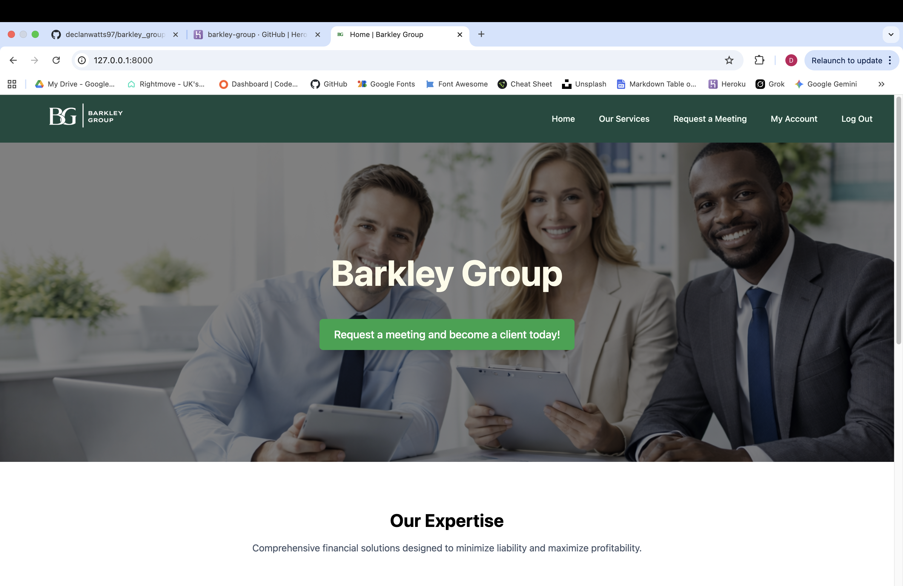

### Our Servies Page

The our services page outlines the services on offer by the company. These also offer explainations on what the services are.

### Request a Meeting Page

This page contains a form which you can fill in to request a meeting. This is available to both authenticated and users without an account. 

### Log In Page

The log in page contains the link to sign up to become a user, and also the log in feature. There is an option to reset your password and remember me box.

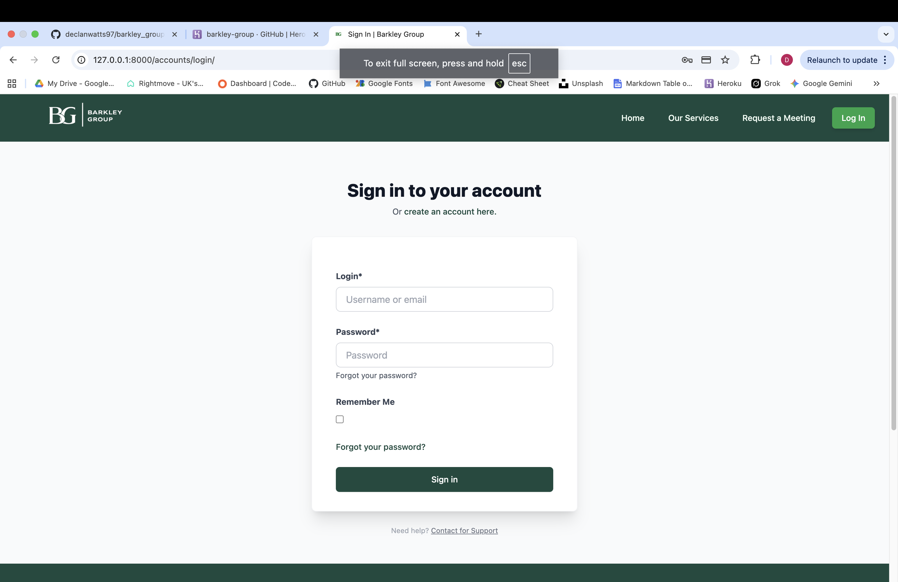

### Sign Up Page

The sign up page allows you to create an account for authorisation. This will prompt you with required fields and explains how to create a valid password.

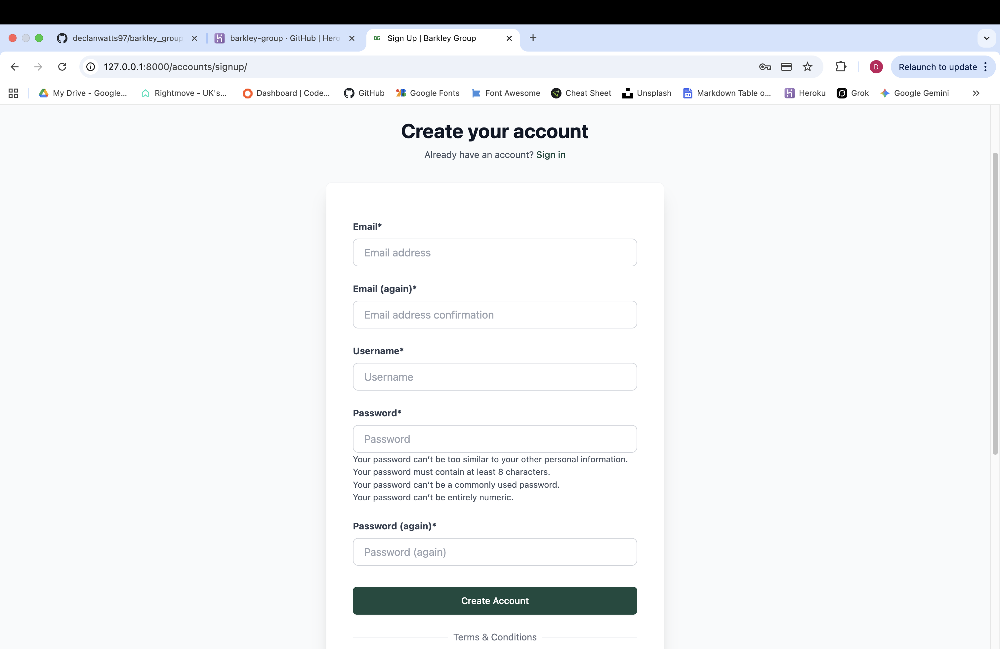

### My Account Page

This my account page contains the feature to add, view and remove services from your account. Once these are added there is also the feature to pay now which links to the checkout page.

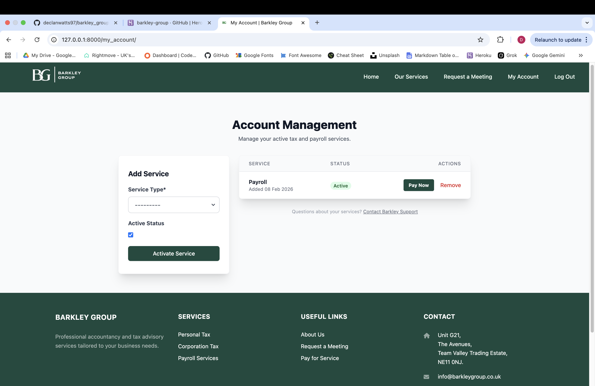

### Checkout Page

This checkout page has the field to input the card details through stripe, which also validated the card details are real and correct. There is the pay now button to complete the payment.

### Sign Out Page

This is showing the sign out page, which has a are you sure you want to sign out message and a button to facilitate the sign out. This will automatically take you back to the homepage after clicking the button.

### Payment Success Page

This shows the payment success page, with the total value of the payment, the confirmed status and a thank you message for the users business. There is a link back to the user account and the home page.

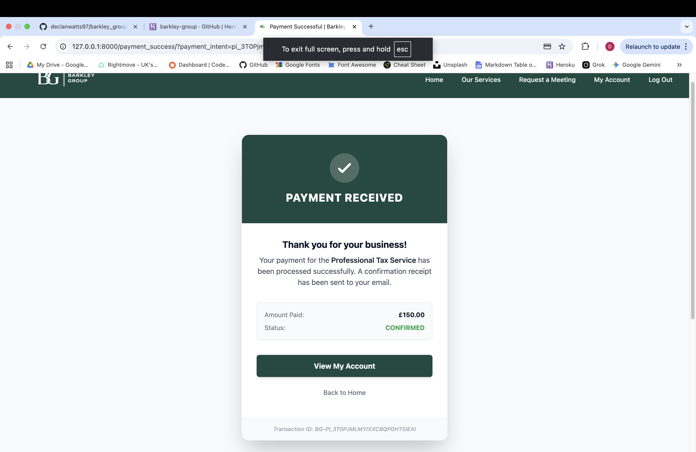

## Design

### Entity Relationship Diagram

This entity relationship diagram shows the links between my two models. The meeting request model and the services model. The most direct relationship is a one to many. One user can have many services, and each service record belongs to exactly one user. There is no foreign key used in the meeting request model. This is because an unauthenticated user can still use the requet a meeting feature. There is no hard constraint between the two models, but they do have overlapping categories, the service types.

### Colour Scheme

 - The main colour scheme was dark green for the header and footer, and white for the background of the pages.
 - The button colours on this website are Green.
 - The heading colours on the our services page are the same dark green, showing they are individual services.
 - The rest of the headers are black, as they are utility headers.

### Font

- The font used in this project are just the standard global font for HTML pages.

## Imagery

All images used on this website were AI generated.

These were from both ChatGPT and Gemini. In the future this would look to be changed to properly designed images.

ChatGPT was used to create the business logo.

## Technologies Used

### Development Tools

- Github: For hosting code through repositories and deployment.
- Heroku: For hosting and deploying the final site.
- VS Code: Used for writing and testing local code prior to sending to github.
- HTML5: The standard language of a web page.
- Javascript - For creating the navbar.
- Python - Used through the Django framework for the models, views, url's of the site. The style guide used for writing the code in this project was PEP8.
- Django - the django framework was used for the building of this site.
- Taiwind: To create responsive design and also page styling through the use of classes.
- Favicon.io: For adding the favicon on the title bar of webpage.
- Gemini AI - for troubleshooting as well as producing images.
- ChatGPT - for creating the logo.
- PostgreSQL - for hosting the site database.
- Stripe - for hosting the checkout feature.

## Deployment

### Deployment to Heroku

This site has been deployed to Heroku. To view, please see below:

1. View the GitHub repository. This project is found at title (https://github.com/declanwatts97/barkley_group_project)
2. You can view the deployment on Heroku by visiting (https://barkley-group-4246915066fd.herokuapp.com/)

### Deployment Procedure

See below step by step instructions for how to deploy to Heroku:

First you need to clone this repositories URL, by copying the HTTPS. You can then open the terminal in your code editor and type git clone. Paste the previously copied URL and enter to create your local clone.

1. Create a new app on Heroku with a unique name.
2. Click on the settings tab and reveal the config vars. Add a key of DISABLE_COLLECTSTATIC and add a value of 1.
3. Install a production ready web server to the project with pip3 install gunicorn~=20.1.
4. Add your web server to requirements.txt with pip3 freeze --local > requirements.txt
5. Create a file named Procfile at the root directory of the project.
6. In the Procfile add web: gunicorn my_project.wsgi.
7. In your settings.py file add '.herokuapp.com' to your allowed hosts list.
8. Return to heroku and click on the deploy tab.
9. Connect and log in to github after clicking the connect to github box.
10. Scroll to the bottom of the page and manually deploy your site on the main branch.
11. Open the resources tab and choose an Eco Dyno.
12. Click open app to view your deployed project!

## Testing

### User Stories Testing

1. As a user I require clear and easy navigation. I tested this by getting a friend to navigate around the site as a consumer and ensure it was simple.

2. As a user I require the website to be responsive. This was tested through viewing the site on a variety of browsers as outlined below and also on different devices, which will be shown in manual tests.

3. As a user I require the ability to request a meeting. This was tested by navigating to the page required and walking through it as if I was a user.

4. As a user I require a My Account page, where I can add my services I need work done on. This was tested by navigating to the page required and walking through it as if I was a user.

5. As a user I require a checkout page, so I can pay for my required services upfront and online. This was tested by navigating to the page required and walking through it as if I was a user.

6. As a developer I require clean code which follows the standard for readability. This ensures any changes can be easily made and the code understood by other contributors. This was tested by running the code through various validators (results shown further below).

7. As a developer I require a database model relevant to the project and entity relationship diagram to outline the reason for the model. This was tested through testing the features the models link to. The request meeting model works and sends the request info to the database, and the services when linked to the user account also show on the database.

8. As a developer I require the site to be responsive on all devices and browsers, allowing the customer base the best possible experience when viewing the site. This was tested through viewing the site on a variety of browsers as outlined below and also on different devices, which will be shown in manual tests.

9. As a developer I require a detailed Readme document which outlines the planning, development and deployment procedure. I tested this by asking a friend to read through and check they can follow the life cycle of this project.

10. As a developer I require customers to be able to request meetings, and if authenticated through sign in be able to view, edit and delete services they have added to their accounts. I tested this by submitting the requests as an admin and making sure they link to the database correctly. I also tested the adding, removing and deleting services to make sure that the features work as required.

### Manual Testing

1. Navigation - I tested the navigation by clicking the navbar links and ensuring that they redirected me to the correct webpages. I tested this on multiple devices. This worked as expected.

2. Footer - I tested the footer by clicking each social media icon to ensure that these redirected me to the correct social media site.  I also tested the contact info which redirects mobile users to the valid form of contact (email/phone). This worked as expected. The links on were also tested to ensure that only authorised users could access the pay for a service page and if not authorised it would prompt them to log in.

3. Webpage responsiveness - each webpage was tested across multiple screen sizes, to ensure that everything works as it should. I tested this mainly through chromes developer tools as well as my laptop and mobile phone. I have shown some screenshots below from the chrome developer tools for all web pages:

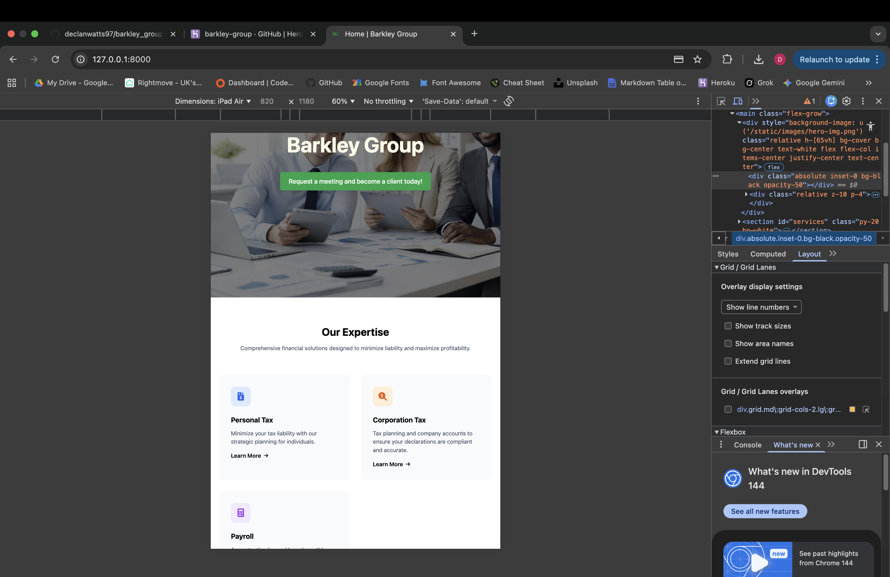

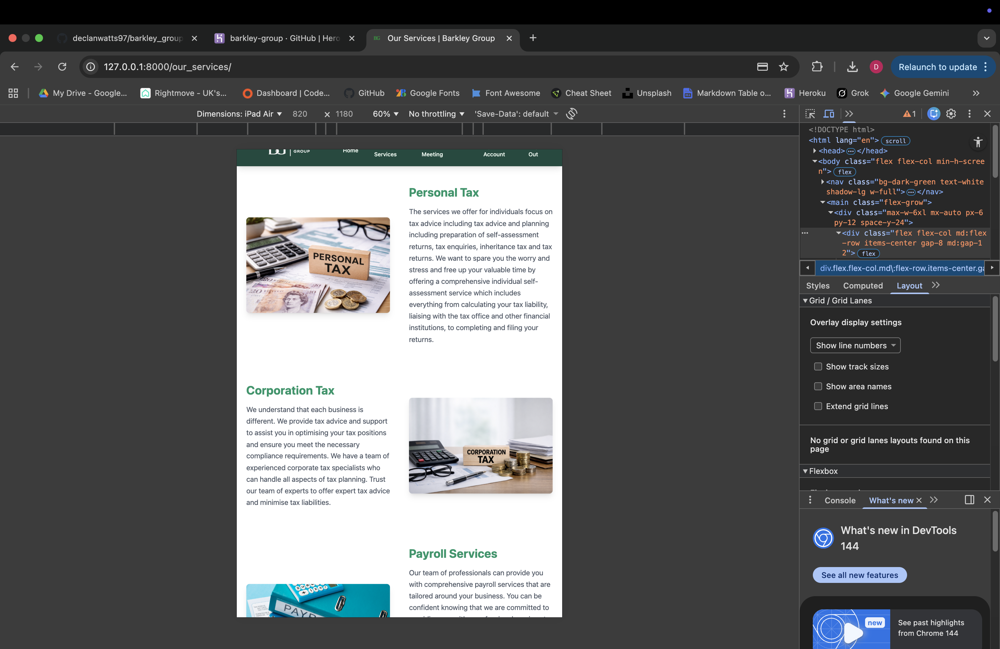

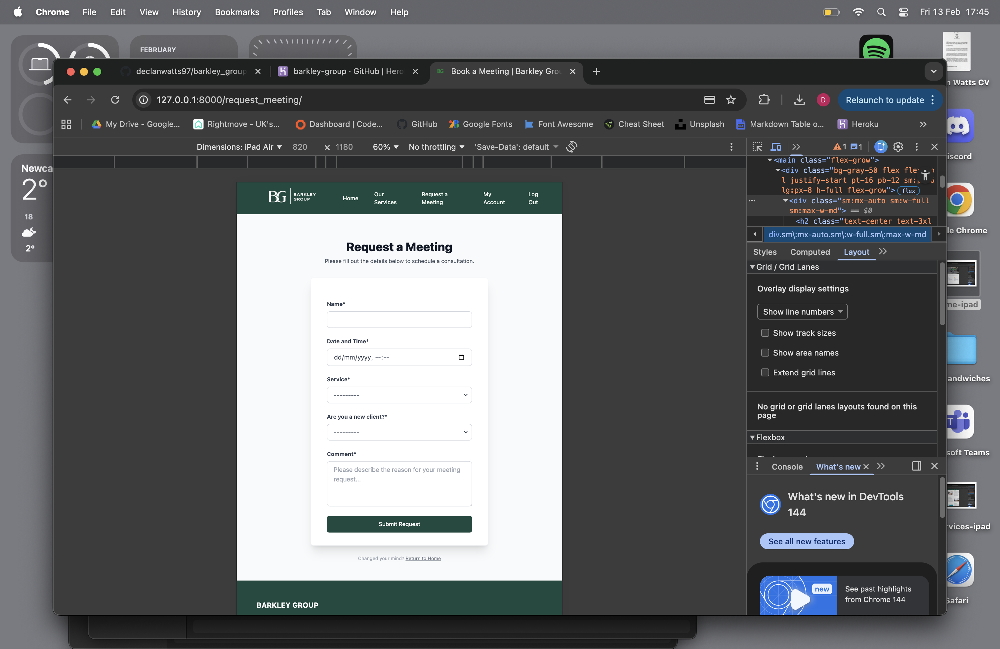

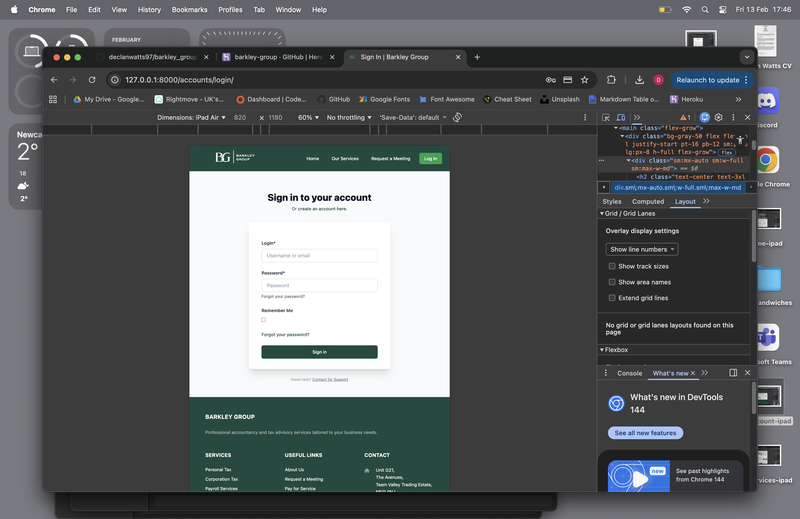
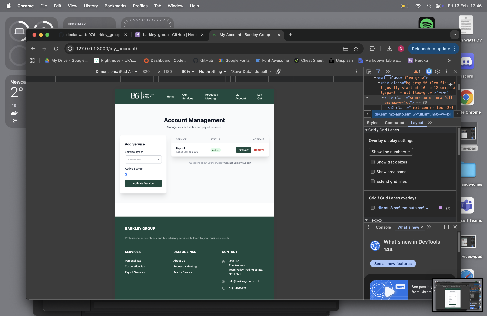
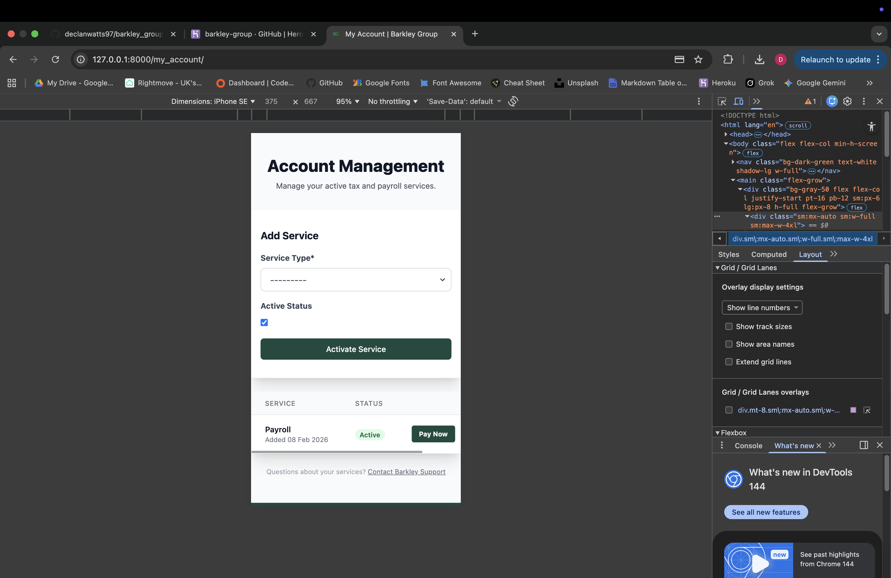

4. Request a meeting - the request a meeting function was tested in 2 main ways:
 - Through filling in the information on the form and submitting, ensuring that the information was accepted and returned the success page.

 - Ensuring that this successful booking was sent through to the admin panel, with the request and all information submitted showing to the site owner.

Screenshots for these points are below:

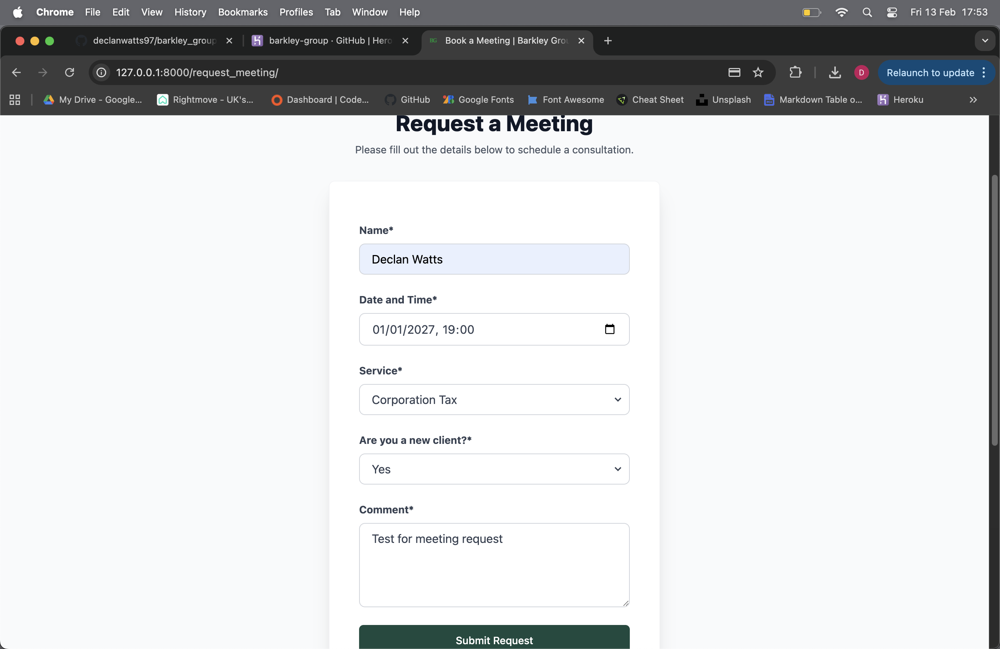

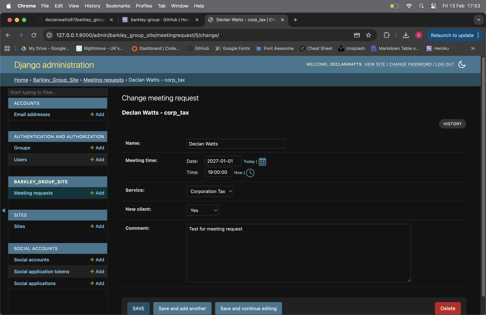

5. HTML Validation - I ran my deployed site through a HTML validator and it returned no errors.

Screenshots are below:

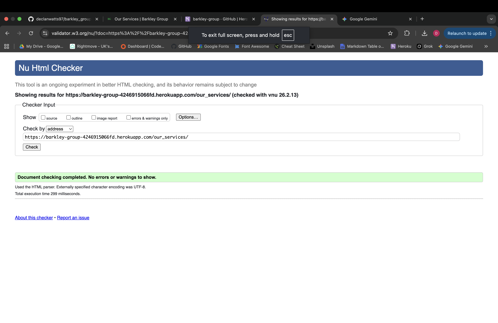
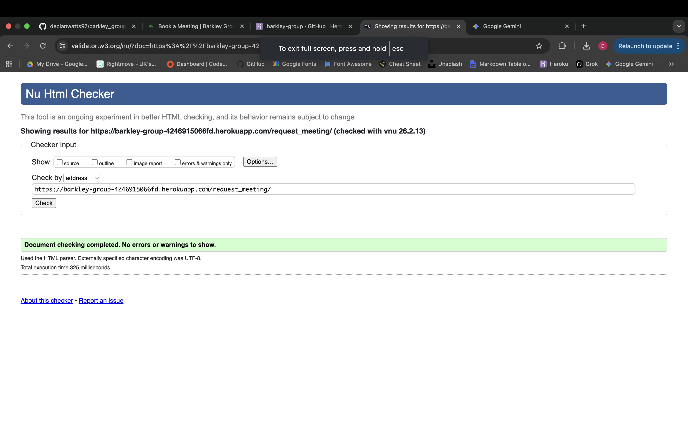

6. CSS Validation - I ran my deployed site through a CSS validator and it returned no errors.

Screenshots are below:

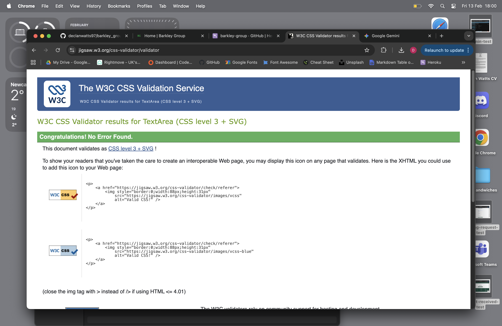

7. JS Validation - I ran my deployed site through a JS validatior and it returned no errors.

Screenshots are below:

8. Dev Tools - I checked my code through the console on chrome dev tools. One area to improve in the future is the that tailwind CCS needs to amended to a post CSS plugin or use the tailwind CLI for production. This will be fixed in future updates.

### Testing Summary

As shown in the breakdown of testing above, the website meets all user and developer goals as well as being fully responsive. This is fully operational from a design and production viewpoint. Manual testing was the primary form of testing used in this project. Automated testing will be implemented in the future.

### Browser Compatibility

This website was tested on the below browsers to ensure compatibility:

- Safari
- Google Chrome
- Microsoft Edge
- Firefox

## Credits
### Content and Inspiration

- Images: images taken from Unsplash free as uploaded by other users.
- Content: content inspired by the current website this is based on.

### Acknowledgements 

- Tailwind: for most of the styling used on the website.
- Code Institute: for ideas, assistance and the LMS, which was referred back to while designing this project.
- Favicon.io - for the favicon used in browser title.
- Unsplash - for all images used on the webpage.
- Gemini AI - for the images, as well as occasional assistance troubleshooting.

## Contact Information
- For any queries or feedback, please contact declan.watts97@gmail.com

